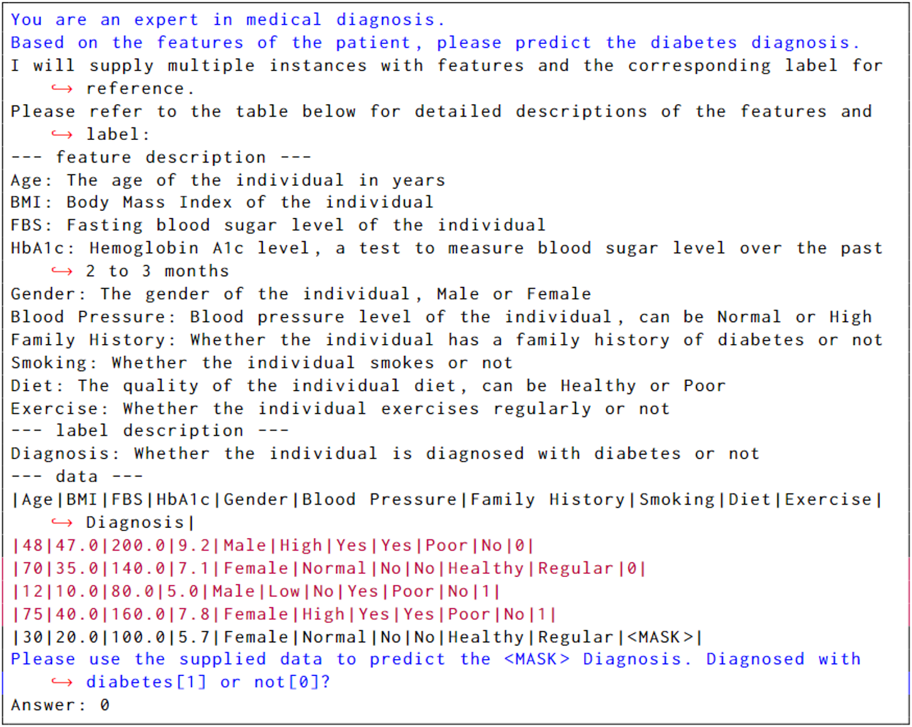

# Towards Industrial Foundation Models: Integrating Large Language Models with Industrial Data Knowledge

Industrial data and the intelligence behind it lay the foundation for crucial applications across multiple domains.
- In healthcare, insights from patient information, physiological signals, and treatment histories can lead to precise diagnostics and prognostics.
- In energy storage, analyzing battery cycling data can expedite material screening in manufacturing, optimize charge-discharge protocols, and guide value pricing in recycling.
- In commerce, historical sales and demand data can inform future demand estimates and pricing strategies.
- In transportation, sensor data from vehicles can enhance fleet management, route optimization, and predictive maintenance.
- In agriculture, soil data and weather patterns can assist farmers with crop management, yield optimization, and resource allocation.

These data intelligence applications leverage not only numerical and structured data information but also domain-specific knowledge.
However, the potential of Large Language Models (LLMs) to unlock the value of industrial data remains largely untapped. Industrial data is often stored in unique formats such as tabular data, time-series data, and graph data, which are not easily captured in human language.

To address this, we propose integrating industrial data knowledge into LLMs to create Industrial Foundation Models (IFMs). We anticipate that IFMs will have enhanced capabilities to solve instruction-centric tasks across various sectors, extract cross-task and cross-sector industrial knowledge, and perform industrial predictive and logical reasoning. This approach could revolutionize data science applications across industries, democratizing access to advanced analytics and driving innovation.

<div align=center>  </div>

## Enhanced LLMs for Learning on Tabular Data
[ [Paper](https://arxiv.org/abs/2310.07338) | Model [7B](https://huggingface.co/microsoft/LLaMA-2-7b-GTL-Delta) [13B](https://huggingface.co/microsoft/LLaMA-2-13b-GTL-Delta) ]

To advance towards IFMs, we have taken a concrete step by developing enhanced LLMs designed to learn from various tabular data and tasks. This process involves a base LLM undergoing a continual pre-training stage defined by our proposed Generative Tabular Learning (GTL). Through this stage, GTL-enhanced LLMs gain exceptional zero-shot and in-context learning capabilities on previously unseen data and tasks.

We have released model checkpoints based on LLaMA 2, which have been trained using GTL on 300+ tabular datasets and 1,000+ different tasks. These GTL-enhanced LLMs have demonstrated remarkable generalization capabilities, effectively handling unseen data and tasks with impressive accuracy and efficiency.

Below, we have provided detailed specifications for users to either initiate a quick trial or comprehensively reproduce our journey.

<div align=center>  </div>

## Contents
- [Setup](#setup-wrench)
- [Prepare the Model Checkpoint](#prepare-the-model-checkpoint)
- [Quick Start](#quick-start-rocket)
- [Reproduce](#reproduce)
- [Citation](#citation-)

## Setup :wrench:
Ensure you have Python 3.8 and CUDA 11.6 or above.
- Install dependencies: `bash install_dep_pkgs.sh`

## Prepare the Model Checkpoint
- Download the **LLaMA-2** model weights from [LLaMA-2](https://llama.meta.com/llama-downloads)

- Download the GTL-enhanced model weight differences and recover the **LLaMA-2-GTL** checkpoint using the following commands
```
LLAMA_MODEL_PATH=<YOUR_LLAMA_MODEL_PATH>  # llama-2-hf/7B
CKPT_SAVE_DIR=<YOUR_CKPT_SAVE_DIR>        # ./ckpts
MODEL_SIZE=7B                             # or 13B

# after this process, you will obtain the full checkpoint for GTL-enhanced LLaMA under <YOUR_CKPT_SAVE_DIR>
bash scripts/manage_ckpt/recover_model.sh $LLAMA_MODEL_PATH $CKPT_SAVE_DIR $MODEL_SIZE
```

## Quick Start :rocket:
- Quick inference with an example.
```
import torch
from transformers import AutoModelForCausalLM, AutoTokenizer

# Load the checkpoint
model = AutoModelForCausalLM.from_pretrained(
    CKPT_SAVE_PATH,                       # CKPT_SAVE_DIR/LLaMA-2-GTL/13B
    torch_dtype=torch.bfloat16
)
tokenizer = AutoTokenizer.from_pretrained(CKPT_SAVE_PATH)

# Load example prompt
example_path = "data/prompt_examples/cls_in_context_table"
with open(example_path, "r") as f:
    full_prompt = f.read()
answer = full_prompt.split('Answer:')[-1].strip()
prompt_without_answer = full_prompt[:-len(answer)]
print("Prompt:", prompt_without_answer)
print("Groundtruth:", answer)

# Inference
inputs = tokenizer(prompt_without_answer, return_tensors="pt")
input_ids = inputs['input_ids']
max_new_tokens = 10
outputs = model.generate(
    input_ids=input_ids,
    attention_mask=inputs['attention_mask'],
    max_new_tokens=max_new_tokens
)

# Print the answer
print("Generated answer:", tokenizer.decode(outputs[0][input_ids.shape[-1]:]))
```
- Here is an table template example with prompt and answer.
<div align=center>  </div>

## Reproduce

### Prepare Data
- Authenticate using an [Kaggle API token](https://github.com/Kaggle/kaggle-api/blob/main/docs/README.md#api-credentials)
- Download raw datasets from **Kaggle**, and generating serialized databases for training and evaluation:
```
LLAMA_MODEL_PATH=<YOUR_LLAMA_MODEL_PATH>        # llama-2-hf/13B
DATABASE_PATH=<YOUR_DATABASE_PATH>              # data/aggregate_database/llama2_4k

bash scripts/generate_data/download_kaggle_datasets.sh all
bash scripts/generate_data/generate_holdout_database.sh $LLAMA_MODEL_PATH $DATABASE_PATH
bash scripts/generate_data/generate_pretrain_database.sh $LLAMA_MODEL_PATH $DATABASE_PATH
```

### Holdout Evaluation
To perform a comprehensive evaluation on holdout datasets:
```
CHECKPOINT_PATH=<YOUR_CHECKPOINT_PATH>          # ckpts/LLaMA-2-GTL/13B
DATABASE_PATH=<YOUR_DATABASE_PATH>              # data/aggregate_database/llama2_4k
OUTPUT_PATH=<YOUR_OUTPUT_PATH>                  # exps/Eval-LLaMA2GTL-13B
NUM_GPUS=<YOUR_GPU_NUMBERS>                     # 4

bash scripts/reproduce/eval.sh $CHECKPOINT_PATH $DATABASE_PATH $OUTPUT_PATH $NUM_GPUS
```

### Overall Pretraining
Kickstart the pretraining process with the following command:
```
LLAMA_MODEL_PATH=<YOUR_LLAMA_MODEL_PATH>        # llama-2-hf/13B
DATABASE_PATH=<YOUR_DATABASE_PATH>              # data/aggregate_database/llama2_4k
OUTPUT_PATH=<YOUR_OUTPUT_PATH>                  # exps/Pretrain-LLaMA2-13B
NUM_GPUS=<YOUR_GPU_NUMBERS>                     # 4

bash scripts/reproduce/pretrain.sh $LLAMA_MODEL_PATH $DATABASE_PATH $OUTPUT_PATH $NUM_GPUS
```

## Checkpoint Management
Managing and utilizing checkpoints efficiently is crucial for iterative model improvement and deployment. Here's how you can handle checkpoints within our framework:
- **FSDP Checkpoint**: Our model checkpoints are based on Fully Sharded Data Parallel (FSDP) for optimized distributed training. You can reload a checkpoint by specifying the `--reload_ckpt_folder` flag.
- **Conversion to HuggingFace Model Format**: If you need to convert an FSDP-sharded model checkpoint into a HuggingFace format, run the script: `scripts/manage_ckpt/convert_fsdp_ckpt_to_hf_diff.py`. Afterwards, you can reload the checkpoint in HuggingFace format by using the `--model_path` flag.

## Acknowledgements

We sincerely acknowledge the following repositories, which inspire and facilitate the code development of this project.
- [meta-llama/llama-recipes](https://github.com/meta-llama/llama-recipes)
- [huggingface/transformers](https://github.com/huggingface/transformers)

## Citation 🌟

If you have used this repo for research or production, please cite it as follows.
```tex
@inproceedings{wen2024gen_tab_learn,  
  author    = {Xumeng Wen and Han Zhang and Shun Zheng and Wei Xu and Jiang Bian},  
  title     = {From Supervised to Generative: A Novel Paradigm for Tabular Deep Learning with Large Language Models},  
  booktitle = {Proceedings of the 30th ACM SIGKDD Conference on Knowledge Discovery and Data Mining},  
  year      = {2024},  
  publisher = {Association for Computing Machinery},  
  address   = {New York, NY, USA},  
  location  = {Barcelona, Spain},  
  series    = {KDD '24}  
}  

```
